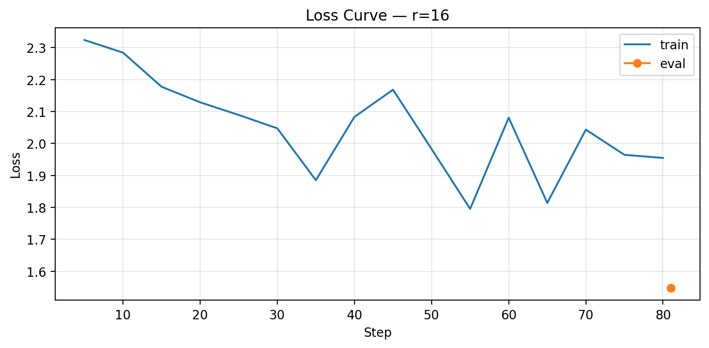

# Lab 21 — Evaluation Report

**Học viên**: Bùi Trần Gia Bảo — 2A202600009  
**Ngày nộp**: 2026-05-07  
**Submission option**: B (HF Hub)

## 1. Setup

- **Base model**: `unsloth/Qwen2.5-3B-bnb-4bit`
- **Dataset**: `gbharti/finance-alpaca`, 241 cleaned samples (216 train + 25 eval)
- **Domain**: Finance instruction following
- **max_seq_length**: 512 (p95 = 353, capped at 1024)
- **GPU**: Tesla T4
- **Training cost estimate**: $0.10 (17.2 minutes at $0.35/hour)
- **Hugging Face Hub link**: https://huggingface.co/solar11781/lab21-qwen25-3b-finance-lora-r16
- **GitHub repo**: https://github.com/solar11781/day21_BuiTranGiaBao_2A202600009
- **Stretch goal completed**: Target ALL layers with `r16_all_layers`
- **W&B**: Not used

## 2. Rank Experiment Results

| rank          | alpha | target_modules       | trainable_params | train_time_min | peak_vram_gb | eval_loss | eval_perplexity |
| ------------- | ----- | -------------------- | ---------------- | -------------- | ------------ | --------- | --------------- |
| Base          | -     | -                    | 0                | 0.0            | 0.0          | 2.0269    | 7.5904          |
| 8             | 16    | q_proj,v_proj        | 1843200          | 3.983          | 5.5854       | 1.5899    | 4.9031          |
| 16            | 32    | q_proj,v_proj        | 3686400          | 4.1822         | 4.9835       | 1.548     | 4.7022          |
| 64            | 128   | q_proj,v_proj        | 14745600         | 4.0374         | 6.3658       | 1.5462    | 4.6937          |
| 16_all_layers | 32    | q,k,v,o,gate,up,down | 29933568         | 5.0319         | 8.9916       | 1.5718    | 4.8155          |

Kết quả cho thấy cả 3 LoRA ranks đều cải thiện perplexity so với base model. Base model có perplexity 7.5904, trong khi r=8 đạt 4.9031, r=16 đạt 4.7022, và r=64 đạt 4.6937. Về mặt số liệu, r=64 có perplexity tốt nhất, nhưng mức cải thiện so với r=16 rất nhỏ: 4.6937 so với 4.7022. Trong khi đó, số trainable parameters tăng mạnh từ 3,686,400 ở r=16 lên 14,745,600 ở r=64. Điều này cho thấy có diminishing returns khi tăng rank từ 16 lên 64. r=64 dùng nhiều parameters hơn nhưng quality gain không lớn. Stretch run `16_all_layers` target nhiều modules hơn (`q,k,v,o,gate,up,down`) và có 29,933,568 trainable parameters, nhưng perplexity lại là 4.8155, thấp hơn base nhưng kém hơn r=16 q/v adapter. Vì vậy, trong experiment này, target ALL layers không giúp cải thiện perplexity so với simple q/v LoRA.

## 3. Loss Curve Analysis

.

Training loss giảm trong quá trình fine-tuning cho thấy LoRA adapter đã học được Alpaca instruction format và finance-domain response style từ dataset. Vì chạy trên Tesla T4 nên tôi không bật evaluation during training để tránh OOM. Do đó, phần overfitting không được kiểm tra bằng eval curve theo từng step, mà được đánh giá chủ yếu bằng final eval loss và final perplexity.

Final perplexity giảm từ 7.5904 ở base model xuống 4.7022 ở r=16. Điều này cho thấy fine-tuning có giúp model fit tốt hơn với evaluation set. Tuy nhiên, vì dataset chỉ có 241 cleaned samples, tôi không thể kết luận rằng model generalize tốt cho mọi finance task. Kết quả hợp lý nhất là: adapter đã học tốt hơn format và style của dataset, nhưng vẫn cần thêm dữ liệu và broader eval prompts nếu deploy thực tế.

## 4. Qualitative Comparison

### Example 1

**Prompt**: Explain the difference between revenue, profit, and cash flow for a beginner.

**Base output**: Revenue, profit, and cash flow are all important metrics for businesses. Revenue is the total amount of money a business generates from its operations, while profit is the difference between revenue and expenses. Cash flow is the amount of money a business has available to spend, which is calculated by subtracting all expenses from all revenues. The key difference between revenue and profit is that revenue is the tot...

**Fine-tuned r=16 output**: Revenue is the income generated by a company through its business activities. It is the total amount of money that a company earns from selling goods and services. Profit, on the other hand, is the difference between revenue and expenses, which is the net amount of money a company earns after deducting all expenses, including taxes. Cash flow is the flow of money in and out of a company. It is the total amount of cas...

**Judgment**: improved

### Example 2

**Prompt**: What is the difference between a stock and a bond?

**Base output**: Stock and bonds are both types of securities that are issued by companies to raise capital. However, there are some important differences between the two. Stocks represent ownership in a company, while bonds represent a loan to a company. When a company issues stock, it is selling shares of ownership in the company. Shareholders have the right to vote on important issues, such as electing board members and approving ...

**Fine-tuned r=16 output**: A stock is a type of ownership share in a company, while a bond is a type of debt instrument issued by a company, government, or other organization. With a stock, you own a portion of the company and have the right to vote on important decisions, but you do not have a direct claim on the company's assets or earnings. With a bond, you are essentially lending money to the issuer, and in return, you receive regular inte...

**Judgment**: same

### Example 3

**Prompt**: Describe the purpose of a credit score and why it matters.

**Base output**: A credit score is a numerical representation of an individual's creditworthiness. It is used by lenders and other institutions to determine whether or not they should approve a loan or credit card application, and at what interest rate. Credit scores are based on an individual's credit history, which includes information such as payment history, outstanding debt, and the age and type of credit accounts. The higher th...

**Fine-tuned r=16 output**: A credit score is a numerical representation of a person's creditworthiness, based on their credit history and payment history. It is used by lenders and credit reporting agencies to determine whether someone is a good credit risk, and to assess the likelihood of making timely payments on loans and credit cards. A higher credit score indicates a lower risk of default, and can result in lower interest rates and better...

**Judgment**: same

### Example 4

**Prompt**: What are three warning signs that a company may have weak financial health?

**Base output**: Three warning signs that a company may have weak financial health are: 1. A high debt-to-equity ratio, indicating that the company is taking on too much debt. 2. Negative cash flow, which means that the company is not generating enough revenue to cover its expenses. 3. A low revenue growth rate, which indicates that the company is not able to increase its revenue quickly enough to sustain its operations.

**Fine-tuned r=16 output**: Three warning signs that a company may have weak financial health are: 1. Negative or low revenue growth 2. High debt levels 3. Poor cash flow management.

**Judgment**: improved

### Example 5

**Prompt**: Explain what diversification means in investing.

**Base output**: Diversification is the process of spreading investments across different assets or asset classes in order to reduce the risk of loss in the event of an economic downturn or other unforeseen events. By investing in a variety of assets, investors can mitigate the risk of loss by reducing the impact of a single asset or asset class on their overall portfolio. This helps to balance out the risk of loss, making the portfo...

**Fine-tuned r=16 output**: Diversification in investing refers to the practice of spreading investments across different assets, sectors, and industries. The idea behind diversification is that by investing in a variety of assets, a portfolio's risk is reduced and the potential for loss is minimized. By investing in a diversified portfolio, investors can reduce their exposure to the risk of any one asset or sector, which can potentially lead t...

**Judgment**: improved

**Nhận xét**: Fine-tuned output dùng đúng terminology trong investing như assets, sectors, industries, portfolio risk. Vì vậy, response phù hợp finance domain hơn. Nhìn chung, fine-tuned r=16 model thường cho câu trả lời finance-focused hơn base model. Tuy nhiên, không phải prompt nào cũng cải thiện rõ rệt. Một số cases được đánh giá là `same` vì base model vốn đã trả lời tốt.

## 5. Conclusion về Rank Trade-off

Trong experiment này, r=16 là lựa chọn có ROI tốt nhất. r=8 có ít trainable parameters nhất và perplexity tốt hơn base model khá nhiều, nhưng vẫn kém r=16. r=64 có perplexity tốt nhất về mặt số, nhưng chỉ cải thiện rất nhỏ so với r=16: 4.6937 so với 4.7022. Với mức cải thiện nhỏ như vậy, việc tăng trainable parameters từ 3,686,400 lên 14,745,600 không thật sự đáng nếu mục tiêu là deploy practical model trên hardware giới hạn.

Stretch experiment `16_all_layers` cũng cho tôi một insight quan trọng: target nhiều layers hơn không tự động tốt hơn. Run này dùng nhiều parameters và VRAM nhất, nhưng perplexity lại kém hơn r=16 q/v adapter. Có thể với dataset nhỏ 241 samples, all-layers adapter có quá nhiều capacity so với lượng dữ liệu, nên không đem lại lợi ích rõ ràng.

=> Nếu deploy production cho task tương tự, tôi sẽ chọn r=16 với `q_proj` và `v_proj`. Lý do là r=16 có balance tốt giữa quality, memory, training cost, và adapter size. Nó gần như đạt perplexity của r=64 nhưng nhẹ hơn nhiều, dễ train hơn, và phù hợp hơn với Tesla T4.

## 6. What I Learned

- LoRA rank không nên chọn theo kiểu “càng cao càng tốt”. Rank cao hơn tăng capacity, nhưng nếu dataset nhỏ hoặc task không quá phức tạp thì improvement có thể rất nhỏ.
- Base model được giữ ở 4-bit để tiết kiệm VRAM, còn training chỉ update LoRA adapter nhỏ. Chính vì vậy nên có thể fine-tune model 3B trên Tesla T4.
- Perplexity rất hữu ích để compare models, nhưng qualitative evaluation vẫn cần thiết. Ví dụ r=64 có perplexity tốt nhất, nhưng r=16 lại là lựa chọn deployment hợp lý hơn vì trade-off tốt hơn.
- Stretch goal như target ALL layers cần được kiểm chứng bằng số liệu. Trong kết quả của lab này, all-layers không thắng r=16 q/v, nên không nên assume configuration phức tạp hơn sẽ luôn tốt hơn.
